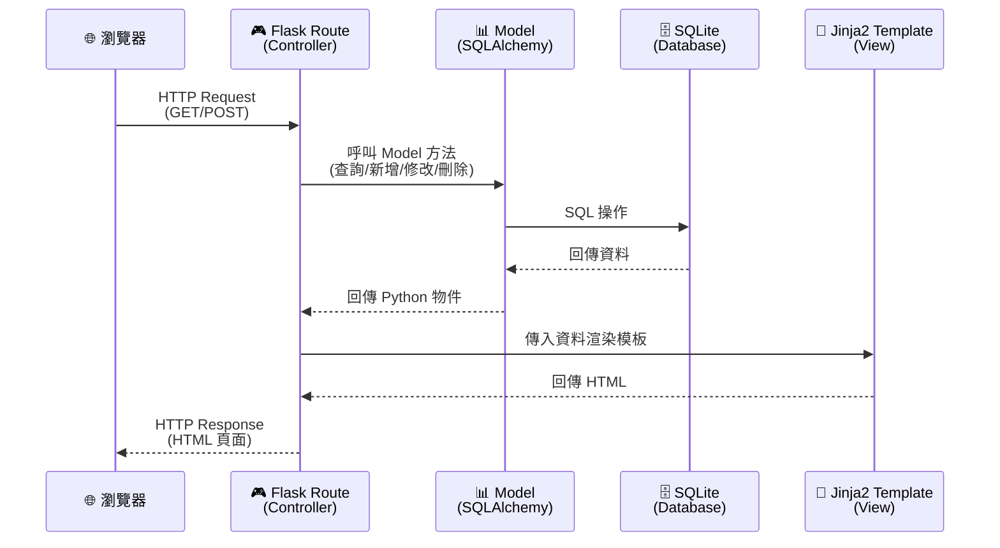
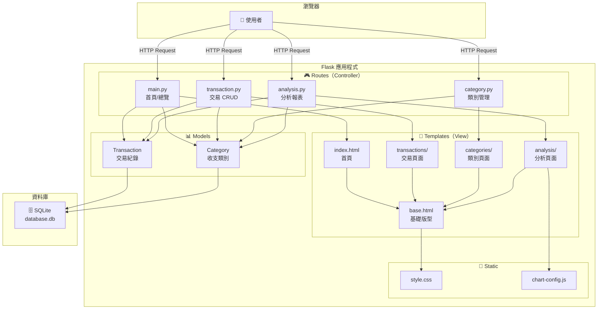
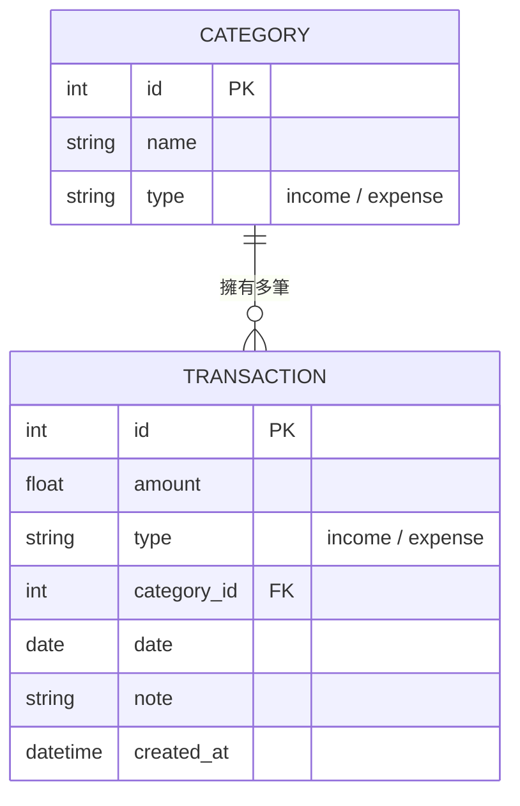

# 記帳軟體系統 — 系統架構文件

> **版本**：v1.0  
> **建立日期**：2026-04-23  
> **對應 PRD**：docs/PRD.md v1.0  

---

## 1. 技術架構說明

### 1.1 選用技術與原因

| 技術 | 用途 | 選用原因 |
|------|------|---------|
| **Python 3** | 程式語言 | 語法簡潔、學習門檻低，適合大學專題開發 |
| **Flask** | 後端框架 | 輕量級微框架，不綁定特定 ORM 或模板引擎，靈活度高，適合中小型專案 |
| **Jinja2** | 模板引擎 | Flask 內建支援，語法直覺，可直接在 HTML 中嵌入 Python 邏輯 |
| **SQLite** | 資料庫 | 零設定、檔案型資料庫，不需安裝額外服務，適合單機應用與開發階段 |
| **SQLAlchemy** | ORM | 物件關聯映射，避免手寫 SQL，降低 SQL Injection 風險，提供資料模型抽象化 |
| **Chart.js** | 前端圖表 | 開源、輕量，支援圓餅圖等常見圖表類型，可透過 CDN 引入，無需建置前端工具鏈 |
| **HTML + CSS + JS** | 前端介面 | 不需前後端分離，由 Flask + Jinja2 直接渲染頁面，降低架構複雜度 |

### 1.2 Flask MVC 模式說明

本專案採用 **MVC（Model-View-Controller）** 模式組織程式碼，將資料、畫面與邏輯三者分離：

```
┌─────────────────────────────────────────────────────────┐
│                        瀏覽器                            │
│                   （使用者操作介面）                       │
└────────────┬──────────────────────────────┬──────────────┘
             │ HTTP Request                 ▲ HTTP Response
             ▼                              │
┌─────────────────────────────────────────────────────────┐
│                   Controller（控制器）                    │
│                    app/routes/*.py                       │
│                                                         │
│  • 接收使用者的 HTTP 請求（GET / POST）                    │
│  • 呼叫 Model 進行資料存取                                │
│  • 將結果傳給 View（模板）進行渲染                         │
│  • 處理表單驗證、錯誤處理與重導向                           │
└──────┬──────────────────────────────────────┬────────────┘
       │ 資料存取                               │ 渲染模板
       ▼                                       ▼
┌──────────────────────┐       ┌──────────────────────────┐
│   Model（模型層）     │       │     View（視圖層）        │
│   app/models/*.py    │       │  app/templates/*.html    │
│                      │       │                          │
│ • 定義資料表結構      │       │ • Jinja2 HTML 模板        │
│   (SQLAlchemy ORM)   │       │ • 呈現資料給使用者         │
│ • 封裝資料庫操作      │       │ • 包含表單、列表、圖表     │
│ • 資料驗證邏輯        │       │ • 引入 CSS / JS 靜態資源  │
└──────────┬───────────┘       └──────────────────────────┘
           │ SQL 查詢
           ▼
┌──────────────────────┐
│    SQLite 資料庫      │
│  instance/database.db│
└──────────────────────┘
```

| 層級 | 對應位置 | 職責 |
|------|---------|------|
| **Model（模型）** | `app/models/` | 定義資料結構（交易紀錄、類別），封裝 CRUD 操作，處理資料驗證 |
| **View（視圖）** | `app/templates/` | 以 Jinja2 模板渲染 HTML 頁面，負責使用者看到的所有畫面 |
| **Controller（控制器）** | `app/routes/` | 接收 HTTP 請求、呼叫 Model、選擇模板，串接整個流程 |

---

## 2. 專案資料夾結構

```
web_app_development2/
│
├── docs/                          # 📄 專案文件
│   ├── PRD.md                     #    產品需求文件
│   ├── ARCHITECTURE.md            #    系統架構文件（本文件）
│   └── ...                        #    其他設計文件（流程圖、DB Schema 等）
│
├── app/                           # 🏠 應用程式主目錄
│   │
│   ├── __init__.py                #    Flask App 工廠函式（create_app）
│   │
│   ├── models/                    # 📊 Model 層 — 資料庫模型
│   │   ├── __init__.py            #    匯出所有模型
│   │   ├── transaction.py         #    交易紀錄模型（Transaction）
│   │   └── category.py           #    收支類別模型（Category）
│   │
│   ├── routes/                    # 🎮 Controller 層 — Flask 路由
│   │   ├── __init__.py            #    註冊所有 Blueprint
│   │   ├── main.py                #    首頁 / 總覽路由
│   │   ├── transaction.py         #    交易紀錄 CRUD 路由
│   │   ├── category.py           #    類別管理路由
│   │   └── analysis.py           #    分析報表路由（圓餅圖、月度摘要）
│   │
│   ├── templates/                 # 🎨 View 層 — Jinja2 HTML 模板
│   │   ├── base.html              #    基礎版型（共用 header / footer / navbar）
│   │   ├── index.html             #    首頁 — 餘額統計 + 近期交易
│   │   ├── transactions/          #    交易相關頁面
│   │   │   ├── list.html          #       交易列表（含搜尋篩選）
│   │   │   ├── form.html          #       新增 / 編輯交易表單
│   │   │   └── delete.html        #       刪除確認頁面
│   │   ├── categories/            #    類別管理頁面
│   │   │   ├── list.html          #       類別列表
│   │   │   └── form.html          #       新增 / 編輯類別表單
│   │   └── analysis/              #    分析報表頁面
│   │       ├── charts.html        #       圓餅圖分析
│   │       └── summary.html       #       月度收支摘要
│   │
│   └── static/                    # 📁 靜態資源
│       ├── css/
│       │   └── style.css          #    全站樣式表
│       └── js/
│           └── chart-config.js    #    Chart.js 圖表設定與初始化
│
├── instance/                      # 🗄️ 實例資料（不進版控）
│   └── database.db                #    SQLite 資料庫檔案
│
├── app.py                         # 🚀 應用程式入口點
├── config.py                      # ⚙️ 組態設定（資料庫路徑、SECRET_KEY 等）
├── requirements.txt               # 📦 Python 套件依賴清單
├── .gitignore                     # 🚫 Git 忽略規則
└── README.md                      # 📖 專案說明
```

### 各目錄 / 檔案用途說明

| 路徑 | 說明 |
|------|------|
| `app/__init__.py` | **Flask 應用工廠**：使用 `create_app()` 模式建立 Flask 實例，初始化資料庫、註冊 Blueprint |
| `app/models/` | **資料模型層**：定義 SQLAlchemy 模型類別，每個檔案對應一張資料表 |
| `app/routes/` | **路由控制層**：使用 Flask Blueprint 拆分不同功能模組的路由，保持程式碼組織清晰 |
| `app/templates/` | **HTML 模板層**：以 `base.html` 為基礎版型，各子頁面以 `` 繼承共用結構 |
| `app/static/` | **靜態資源**：CSS 樣式與 JavaScript 檔案，由 Flask 自動提供靜態檔案服務 |
| `instance/` | **實例目錄**：存放 SQLite 資料庫，此目錄不加入版控，避免資料衝突 |
| `app.py` | **入口點**：呼叫 `create_app()` 並啟動開發伺服器 |
| `config.py` | **組態設定**：集中管理資料庫 URI、SECRET_KEY 等設定值 |

---

## 3. 元件關係圖

### 3.1 請求處理流程



### 3.2 系統模組關係圖



### 3.3 資料模型關係圖



---

## 4. 關鍵設計決策

### 決策一：採用 Flask Application Factory 模式

**決策**：使用 `create_app()` 工廠函式建立 Flask 實例，而非直接建立全域 `app` 物件。

**原因**：
- 支援不同環境（開發 / 測試 / 生產）使用不同組態
- 方便撰寫單元測試時建立獨立的 app 實例
- 避免循環匯入（circular import）問題
- 是 Flask 官方推薦的最佳實踐

```python
# app/__init__.py
def create_app(config_name='default'):
    app = Flask(__name__)
    app.config.from_object(config[config_name])
    
    db.init_app(app)
    
    # 註冊 Blueprint
    from .routes import main, transaction, category, analysis
    app.register_blueprint(main.bp)
    app.register_blueprint(transaction.bp)
    app.register_blueprint(category.bp)
    app.register_blueprint(analysis.bp)
    
    return app
```

---

### 決策二：使用 Blueprint 拆分路由模組

**決策**：每個功能模組使用獨立的 Flask Blueprint，而非將所有路由寫在同一個檔案。

**原因**：
- 隨功能增加，單一檔案會變得過於龐大，難以維護
- Blueprint 讓每位團隊成員可以負責不同模組，減少合併衝突
- 各模組可獨立設定 URL 前綴，路由結構更清晰

| Blueprint | URL 前綴 | 負責功能 |
|-----------|---------|---------|
| `main` | `/` | 首頁、總覽 |
| `transaction` | `/transaction` | 交易紀錄 CRUD |
| `category` | `/categories` | 類別管理 |
| `analysis` | `/analysis` | 圓餅圖、月度摘要 |

---

### 決策三：使用 SQLAlchemy ORM 而非原生 sqlite3

**決策**：透過 Flask-SQLAlchemy 操作資料庫，而非直接撰寫 SQL 語句。

**原因**：
- ORM 將資料表映射為 Python 類別，操作更直覺
- 自動處理 SQL 參數化查詢，有效防止 SQL Injection
- 提供 Migration 支援（搭配 Flask-Migrate），方便未來修改資料表結構
- 程式碼可讀性更高，降低團隊成員的學習成本

```python
# 使用 ORM（推薦）
transaction = Transaction.query.filter_by(id=1).first()

# 對比原生 SQL
cursor.execute("SELECT * FROM transactions WHERE id = ?", (1,))
```

---

### 決策四：Chart.js 透過 CDN 引入

**決策**：Chart.js 透過 CDN 載入，不使用 npm 安裝或本地存放。

**原因**：
- 專案不使用前端建置工具（Webpack / Vite），CDN 是最簡單的引入方式
- 減少專案的 `node_modules` 依賴，保持後端為主的架構簡潔性
- CDN 提供壓縮與快取，載入速度通常優於自行託管
- Chart.js 僅用於分析頁面的圓餅圖，功能需求單純

```html
<!-- 在 base.html 或分析頁面中引入 -->
<script src="https://cdn.jsdelivr.net/npm/chart.js"></script>
```

---

### 決策五：使用 Jinja2 模板繼承減少重複

**決策**：建立 `base.html` 基礎版型，所有頁面以 `` 繼承。

**原因**：
- 共用元素（導覽列、頁尾、CSS/JS 引入）只需維護一處
- 修改整體版面風格時，只需修改 `base.html`
- 各子頁面只需定義自己獨特的內容區塊（``）
- 保持模板 DRY（Don't Repeat Yourself），減少維護成本

```html
<!-- base.html -->
<!DOCTYPE html>
<html lang="zh-Hant">
<head>
    <title>記帳簿</title>
    <link rel="stylesheet" href="{{ url_for('static', filename='css/style.css') }}">
</head>
<body>
    <nav><!-- 共用導覽列 --></nav>
    <main>
        
    </main>
    <footer><!-- 共用頁尾 --></footer>
    
</body>
</html>
```

---

## 附錄：Python 套件依賴

```txt
# requirements.txt
Flask>=3.0
Flask-SQLAlchemy>=3.1
```

> **說明**：本專案刻意保持依賴最少化。Flask 內建 Jinja2 模板引擎，SQLite 為 Python 標準函式庫，Chart.js 透過 CDN 引入，因此只需安裝 Flask 與 Flask-SQLAlchemy 兩個套件。
