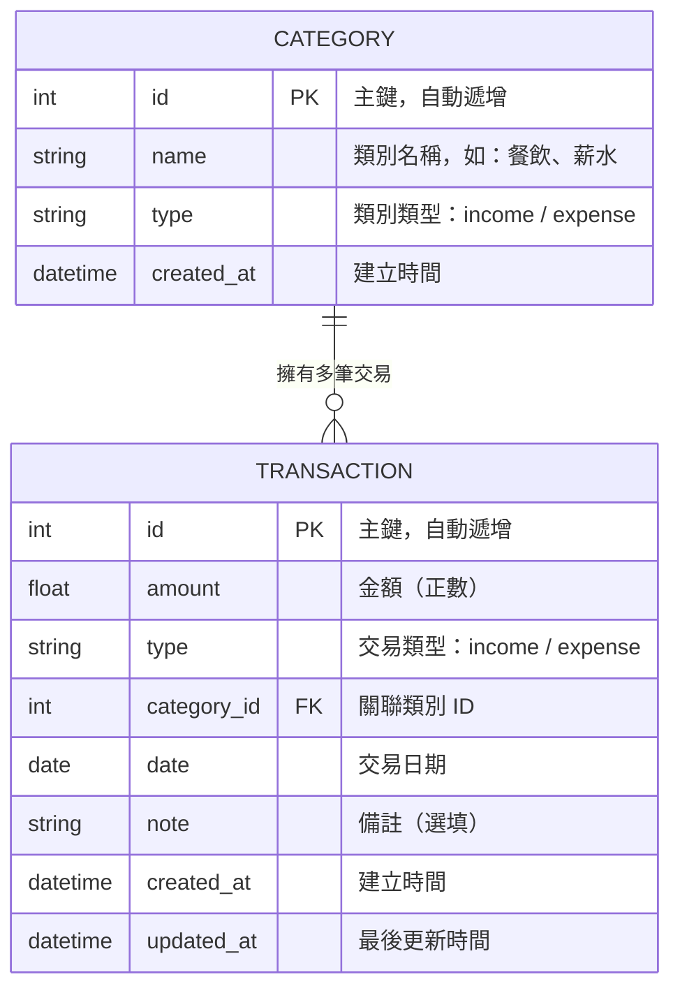

# 記帳軟體系統 — 資料庫設計文件

> **版本**：v1.0  
> **建立日期**：2026-04-23  
> **對應文件**：docs/PRD.md、docs/FLOWCHART.md、docs/ARCHITECTURE.md  

---

## 1. ER 圖（實體關係圖）



### 關聯說明

| 關聯 | 說明 |
|------|------|
| `CATEGORY` → `TRANSACTION` | **一對多**：一個類別可以對應多筆交易紀錄 |
| `TRANSACTION` → `CATEGORY` | **多對一**：每筆交易必須屬於一個類別（透過 `category_id` 外鍵） |

---

## 2. 資料表詳細說明

### 2.1 categories（收支類別表）

儲存所有收入與支出的分類項目。系統預設常用類別，使用者亦可自訂。

| 欄位 | 型別 | 必填 | 預設值 | 說明 |
|------|------|------|--------|------|
| `id` | INTEGER | ✅ | AUTO INCREMENT | 主鍵，自動遞增 |
| `name` | VARCHAR(50) | ✅ | — | 類別名稱（如：餐飲、交通、薪水） |
| `type` | VARCHAR(10) | ✅ | — | 類別類型，僅允許 `income` 或 `expense` |
| `created_at` | DATETIME | ✅ | CURRENT_TIMESTAMP | 建立時間 |

**約束條件**：
- `id` 為 PRIMARY KEY，自動遞增
- `name` + `type` 組合唯一（同類型下不可有重複名稱）
- `type` 僅允許 `income` 或 `expense`

---

### 2.2 transactions（交易紀錄表）

儲存每一筆收入或支出的詳細紀錄。

| 欄位 | 型別 | 必填 | 預設值 | 說明 |
|------|------|------|--------|------|
| `id` | INTEGER | ✅ | AUTO INCREMENT | 主鍵，自動遞增 |
| `amount` | REAL | ✅ | — | 交易金額，必須為正數 |
| `type` | VARCHAR(10) | ✅ | — | 交易類型：`income`（收入）或 `expense`（支出） |
| `category_id` | INTEGER | ✅ | — | 外鍵，關聯至 `categories.id` |
| `date` | DATE | ✅ | — | 交易日期（格式：YYYY-MM-DD） |
| `note` | TEXT | ❌ | `''` | 備註說明（選填） |
| `created_at` | DATETIME | ✅ | CURRENT_TIMESTAMP | 建立時間 |
| `updated_at` | DATETIME | ✅ | CURRENT_TIMESTAMP | 最後更新時間 |

**約束條件**：
- `id` 為 PRIMARY KEY，自動遞增
- `amount` 必須大於 0（CHECK 約束）
- `type` 僅允許 `income` 或 `expense`
- `category_id` 為 FOREIGN KEY，參照 `categories(id)`
- `date` 為常用查詢欄位，需建立索引
- `category_id` 為常用篩選欄位，需建立索引

---

## 3. 索引設計

為提升查詢效能，針對常用查詢欄位建立索引：

| 索引名稱 | 資料表 | 欄位 | 用途 |
|---------|--------|------|------|
| `idx_transactions_date` | transactions | `date` | 加速依日期排序與篩選 |
| `idx_transactions_type` | transactions | `type` | 加速依收入/支出類型篩選 |
| `idx_transactions_category_id` | transactions | `category_id` | 加速依類別篩選與 JOIN 查詢 |
| `idx_categories_type` | categories | `type` | 加速依類別類型篩選 |

---

## 4. 預設資料（Seed Data）

系統初始化時，自動建立以下預設類別：

### 支出類別

| name | type |
|------|------|
| 餐飲 | expense |
| 交通 | expense |
| 娛樂 | expense |
| 購物 | expense |
| 住宿 | expense |
| 醫療 | expense |
| 教育 | expense |
| 其他支出 | expense |

### 收入類別

| name | type |
|------|------|
| 薪水 | income |
| 獎學金 | income |
| 打工 | income |
| 零用錢 | income |
| 投資 | income |
| 其他收入 | income |

---

## 5. 常見查詢語句參考

```sql
-- 計算總餘額
SELECT
    COALESCE(SUM(CASE WHEN type = 'income' THEN amount ELSE 0 END), 0) AS total_income,
    COALESCE(SUM(CASE WHEN type = 'expense' THEN amount ELSE 0 END), 0) AS total_expense,
    COALESCE(SUM(CASE WHEN type = 'income' THEN amount ELSE -amount END), 0) AS balance
FROM transactions;

-- 查詢某月各類別支出佔比（圓餅圖用）
SELECT c.name, SUM(t.amount) AS total, c.type
FROM transactions t
JOIN categories c ON t.category_id = c.id
WHERE strftime('%Y-%m', t.date) = '2026-04'
  AND t.type = 'expense'
GROUP BY c.id
ORDER BY total DESC;

-- 月度收支摘要（近 12 個月）
SELECT
    strftime('%Y-%m', date) AS month,
    SUM(CASE WHEN type = 'income' THEN amount ELSE 0 END) AS total_income,
    SUM(CASE WHEN type = 'expense' THEN amount ELSE 0 END) AS total_expense,
    SUM(CASE WHEN type = 'income' THEN amount ELSE -amount END) AS balance
FROM transactions
WHERE date >= date('now', '-12 months')
GROUP BY month
ORDER BY month DESC;
```
