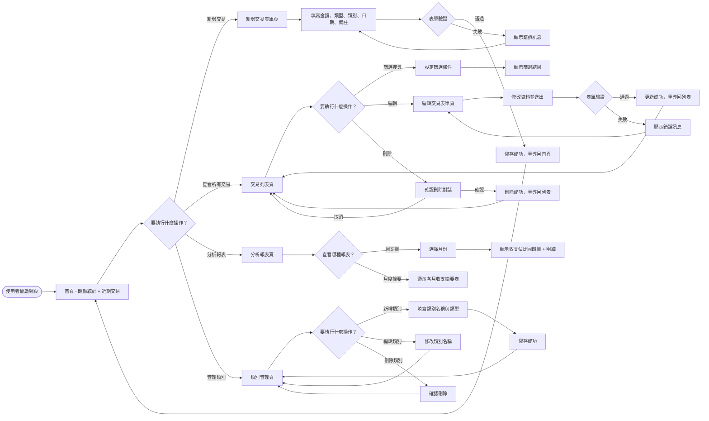
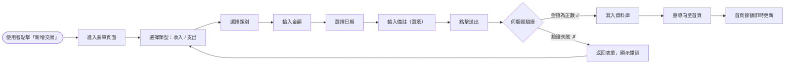
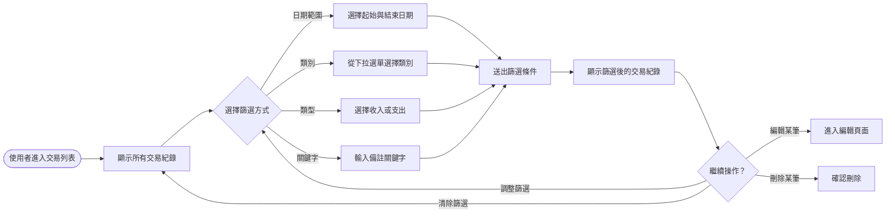
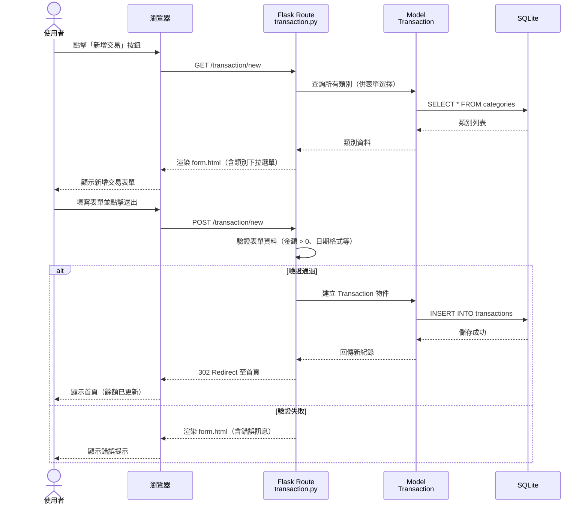
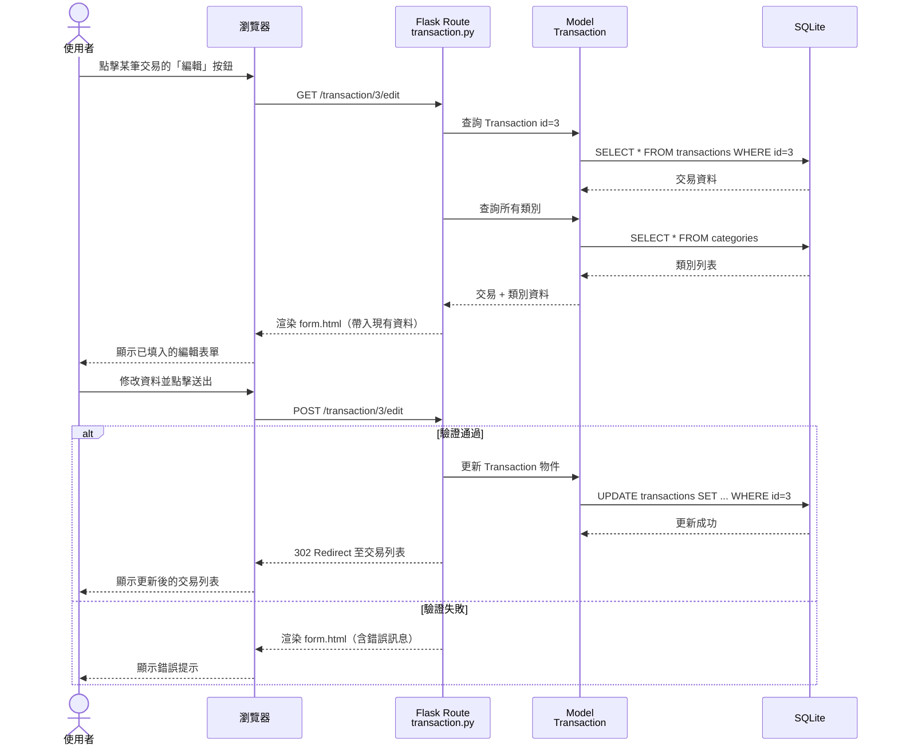
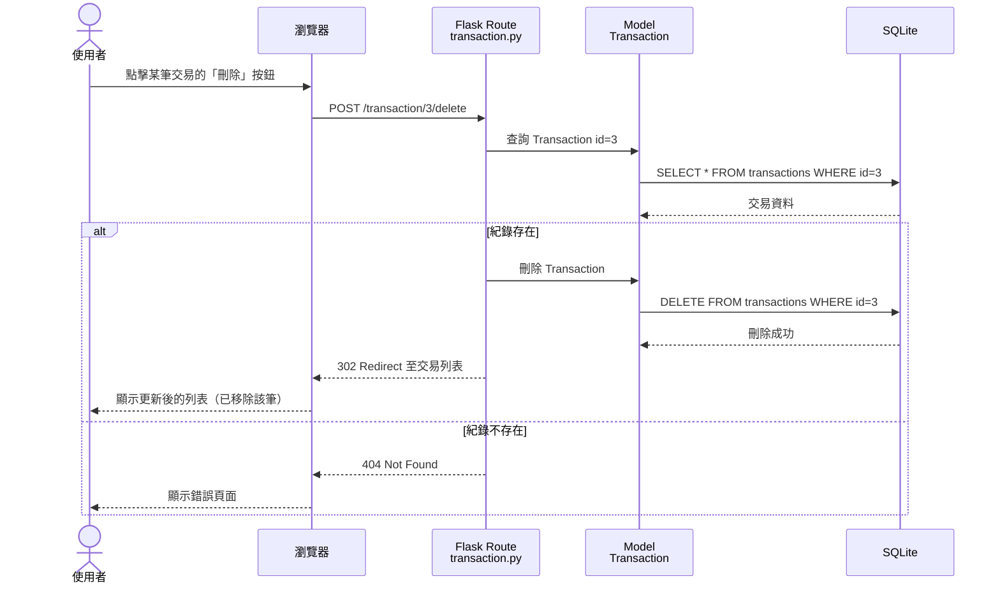
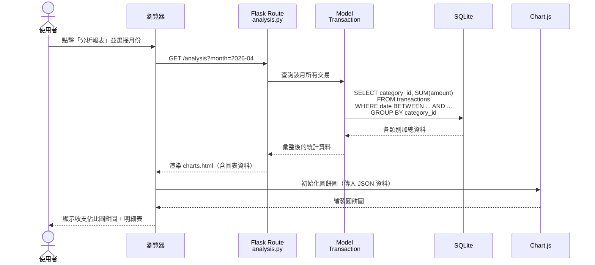
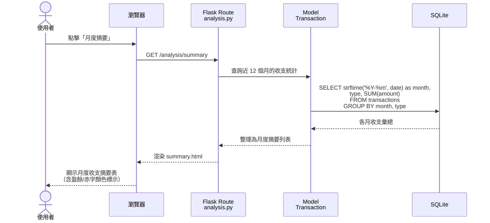
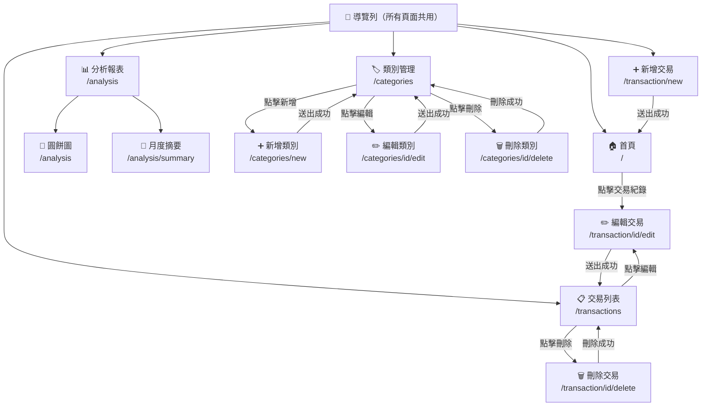

# 記帳軟體系統 — 流程圖文件

> **版本**：v1.0  
> **建立日期**：2026-04-23  
> **對應文件**：docs/PRD.md、docs/ARCHITECTURE.md  

---

## 1. 使用者流程圖（User Flow）

### 1.1 整體操作流程

使用者進入網站後，可在首頁查看餘額統計與近期交易，並從導覽列進入各功能模組。

### 1.2 新增交易流程（詳細版）

### 1.3 搜尋與篩選流程

---

## 2. 系統序列圖（Sequence Diagram）

### 2.1 新增交易紀錄

描述使用者從「點擊新增」到「資料存入資料庫」的完整流程：

### 2.2 編輯交易紀錄

### 2.3 刪除交易紀錄

### 2.4 圓餅圖分析

### 2.5 月度收支摘要

---

## 3. 功能清單對照表

| 功能 | URL 路徑 | HTTP 方法 | 說明 |
|------|---------|-----------|------|
| 首頁總覽 | `/` | GET | 顯示餘額統計與近期交易紀錄 |
| 新增交易（表單） | `/transaction/new` | GET | 顯示新增交易表單 |
| 新增交易（送出） | `/transaction/new` | POST | 驗證並儲存新交易紀錄 |
| 交易列表 | `/transactions` | GET | 顯示所有交易，支援篩選與搜尋 |
| 編輯交易（表單） | `/transaction/<id>/edit` | GET | 顯示編輯交易表單（帶入現有資料） |
| 編輯交易（送出） | `/transaction/<id>/edit` | POST | 驗證並更新交易紀錄 |
| 刪除交易 | `/transaction/<id>/delete` | POST | 刪除指定交易紀錄 |
| 圓餅圖分析 | `/analysis` | GET | 顯示月度各類別收支佔比圓餅圖 |
| 月度摘要 | `/analysis/summary` | GET | 顯示近 12 個月收支摘要表 |
| 類別列表 | `/categories` | GET | 顯示所有收支類別 |
| 新增類別（表單） | `/categories/new` | GET | 顯示新增類別表單 |
| 新增類別（送出） | `/categories/new` | POST | 儲存新類別 |
| 編輯類別（表單） | `/categories/<id>/edit` | GET | 顯示編輯類別表單 |
| 編輯類別（送出） | `/categories/<id>/edit` | POST | 更新類別資料 |
| 刪除類別 | `/categories/<id>/delete` | POST | 刪除指定類別 |

---

## 附錄：頁面導覽關係圖

