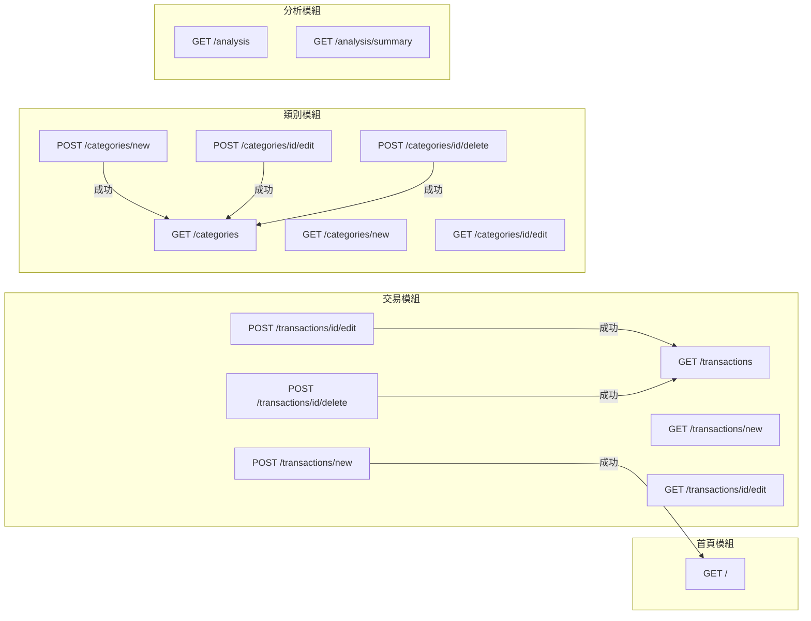

# 記帳軟體系統 — 路由設計文件

> **版本**：v1.0  
> **建立日期**：2026-04-23  
> **對應文件**：docs/PRD.md、docs/ARCHITECTURE.md、docs/DB_DESIGN.md  

---

## 1. 路由總覽表格

### 1.1 首頁模組（main）

| 功能 | HTTP 方法 | URL 路徑 | 對應模板 | 說明 |
|------|-----------|---------|---------|------|
| 首頁總覽 | GET | `/` | `templates/index.html` | 顯示餘額統計與近期交易紀錄 |

### 1.2 交易紀錄模組（transaction）

| 功能 | HTTP 方法 | URL 路徑 | 對應模板 | 說明 |
|------|-----------|---------|---------|------|
| 交易列表 | GET | `/transactions` | `templates/transactions/list.html` | 顯示所有交易，支援篩選與搜尋 |
| 新增交易頁面 | GET | `/transactions/new` | `templates/transactions/form.html` | 顯示新增交易表單 |
| 建立交易 | POST | `/transactions/new` | — | 接收表單，存入 DB，重導向至首頁 |
| 編輯交易頁面 | GET | `/transactions/<id>/edit` | `templates/transactions/form.html` | 顯示編輯交易表單（帶入現有資料） |
| 更新交易 | POST | `/transactions/<id>/edit` | — | 接收表單，更新 DB，重導向至列表 |
| 刪除交易 | POST | `/transactions/<id>/delete` | — | 刪除交易後重導向至列表 |

### 1.3 類別管理模組（category）

| 功能 | HTTP 方法 | URL 路徑 | 對應模板 | 說明 |
|------|-----------|---------|---------|------|
| 類別列表 | GET | `/categories` | `templates/categories/list.html` | 顯示所有收支類別 |
| 新增類別頁面 | GET | `/categories/new` | `templates/categories/form.html` | 顯示新增類別表單 |
| 建立類別 | POST | `/categories/new` | — | 接收表單，存入 DB，重導向至列表 |
| 編輯類別頁面 | GET | `/categories/<id>/edit` | `templates/categories/form.html` | 顯示編輯類別表單 |
| 更新類別 | POST | `/categories/<id>/edit` | — | 接收表單，更新 DB，重導向至列表 |
| 刪除類別 | POST | `/categories/<id>/delete` | — | 刪除類別後重導向至列表 |

### 1.4 分析報表模組（analysis）

| 功能 | HTTP 方法 | URL 路徑 | 對應模板 | 說明 |
|------|-----------|---------|---------|------|
| 圓餅圖分析 | GET | `/analysis` | `templates/analysis/charts.html` | 顯示月度各類別收支佔比圓餅圖 |
| 月度摘要 | GET | `/analysis/summary` | `templates/analysis/summary.html` | 顯示近 12 個月收支摘要表 |

---

## 2. 每個路由的詳細說明

### 2.1 首頁模組

#### `GET /` — 首頁總覽

- **輸入**：無
- **處理邏輯**：
  1. 呼叫 `Transaction.get_balance_summary()` 取得餘額統計
  2. 呼叫 `Transaction.get_recent(limit=10)` 取得近期交易
- **輸出**：渲染 `index.html`，傳入 `summary`（餘額統計）與 `recent_transactions`（近期交易列表）
- **錯誤處理**：無特殊處理

---

### 2.2 交易紀錄模組

#### `GET /transactions` — 交易列表

- **輸入**：Query 參數（皆為選填）
  - `date_from`：起始日期（YYYY-MM-DD）
  - `date_to`：結束日期（YYYY-MM-DD）
  - `type`：交易類型（income / expense）
  - `category_id`：類別 ID（整數）
  - `keyword`：備註關鍵字
- **處理邏輯**：
  1. 解析篩選條件
  2. 呼叫 `Transaction.get_filtered(...)` 取得篩選結果
  3. 呼叫 `Category.get_all()` 取得類別列表（供篩選下拉選單用）
- **輸出**：渲染 `transactions/list.html`，傳入 `transactions`、`categories`、`filters`
- **錯誤處理**：無效的日期格式忽略篩選條件

#### `GET /transactions/new` — 新增交易頁面

- **輸入**：無
- **處理邏輯**：
  1. 呼叫 `Category.get_by_type('income')` 取得收入類別
  2. 呼叫 `Category.get_by_type('expense')` 取得支出類別
- **輸出**：渲染 `transactions/form.html`，傳入 `income_categories`、`expense_categories`、`transaction=None`（表示新增模式）
- **錯誤處理**：無特殊處理

#### `POST /transactions/new` — 建立交易

- **輸入**：表單欄位
  - `amount`（必填，正數）
  - `type`（必填，income / expense）
  - `category_id`（必填，整數）
  - `date`（必填，YYYY-MM-DD）
  - `note`（選填）
- **處理邏輯**：
  1. 驗證表單資料（金額 > 0、類型合法、日期格式正確）
  2. 呼叫 `Transaction.create(...)` 建立紀錄
- **輸出**：成功 → 重導向 `/`；失敗 → 重新渲染表單並顯示錯誤
- **錯誤處理**：
  - 金額非正數 → 顯示「金額必須大於 0」
  - 類別不存在 → 顯示「請選擇有效的類別」
  - 日期格式錯誤 → 顯示「請輸入正確的日期格式」

#### `GET /transactions/<id>/edit` — 編輯交易頁面

- **輸入**：URL 參數 `id`（整數）
- **處理邏輯**：
  1. 呼叫 `Transaction.get_by_id(id)` 取得交易紀錄
  2. 取得所有類別供下拉選單
- **輸出**：渲染 `transactions/form.html`，傳入 `transaction`（現有資料）與類別列表
- **錯誤處理**：ID 不存在 → 404 Not Found

#### `POST /transactions/<id>/edit` — 更新交易

- **輸入**：URL 參數 `id` + 表單欄位（同新增）
- **處理邏輯**：
  1. 呼叫 `Transaction.get_by_id(id)` 取得紀錄
  2. 驗證表單資料
  3. 呼叫 `transaction.update(...)` 更新紀錄
- **輸出**：成功 → 重導向 `/transactions`；失敗 → 重新渲染表單
- **錯誤處理**：同新增交易

#### `POST /transactions/<id>/delete` — 刪除交易

- **輸入**：URL 參數 `id`（整數）
- **處理邏輯**：
  1. 呼叫 `Transaction.get_by_id(id)` 取得紀錄
  2. 呼叫 `transaction.delete()` 刪除紀錄
- **輸出**：重導向 `/transactions`
- **錯誤處理**：ID 不存在 → 404 Not Found

---

### 2.3 類別管理模組

#### `GET /categories` — 類別列表

- **輸入**：無
- **處理邏輯**：呼叫 `Category.get_all()` 取得所有類別
- **輸出**：渲染 `categories/list.html`，傳入 `categories`
- **錯誤處理**：無特殊處理

#### `GET /categories/new` — 新增類別頁面

- **輸入**：無
- **處理邏輯**：無
- **輸出**：渲染 `categories/form.html`，傳入 `category=None`（新增模式）
- **錯誤處理**：無特殊處理

#### `POST /categories/new` — 建立類別

- **輸入**：表單欄位
  - `name`（必填，最多 50 字元）
  - `type`（必填，income / expense）
- **處理邏輯**：
  1. 驗證表單資料
  2. 檢查同類型下是否有重複名稱
  3. 呼叫 `Category.create(...)` 建立類別
- **輸出**：成功 → 重導向 `/categories`；失敗 → 重新渲染表單
- **錯誤處理**：
  - 名稱為空 → 顯示「請輸入類別名稱」
  - 名稱重複 → 顯示「此類別名稱已存在」

#### `GET /categories/<id>/edit` — 編輯類別頁面

- **輸入**：URL 參數 `id`（整數）
- **處理邏輯**：呼叫 `Category.get_by_id(id)` 取得類別
- **輸出**：渲染 `categories/form.html`，傳入 `category`（現有資料）
- **錯誤處理**：ID 不存在 → 404 Not Found

#### `POST /categories/<id>/edit` — 更新類別

- **輸入**：URL 參數 `id` + 表單欄位（同新增）
- **處理邏輯**：
  1. 取得類別
  2. 驗證資料
  3. 呼叫 `category.update(...)` 更新
- **輸出**：成功 → 重導向 `/categories`；失敗 → 重新渲染表單
- **錯誤處理**：同新增類別

#### `POST /categories/<id>/delete` — 刪除類別

- **輸入**：URL 參數 `id`（整數）
- **處理邏輯**：
  1. 取得類別
  2. 檢查是否有關聯的交易紀錄
  3. 呼叫 `category.delete()` 刪除
- **輸出**：重導向 `/categories`
- **錯誤處理**：
  - ID 不存在 → 404 Not Found
  - 有關聯交易 → 顯示提示「此類別下仍有交易紀錄，請先刪除相關交易」

---

### 2.4 分析報表模組

#### `GET /analysis` — 圓餅圖分析

- **輸入**：Query 參數
  - `year`：年份（選填，預設當年）
  - `month`：月份（選填，預設當月）
- **處理邏輯**：
  1. 解析年月參數
  2. 呼叫 `Transaction.get_monthly_category_summary(year, month)` 取得彙總資料
  3. 分離收入與支出資料
- **輸出**：渲染 `analysis/charts.html`，傳入 `income_data`、`expense_data`、`year`、`month`
- **錯誤處理**：無效的年月 → 使用當年當月

#### `GET /analysis/summary` — 月度摘要

- **輸入**：無
- **處理邏輯**：呼叫 `Transaction.get_monthly_summary(months=12)` 取得近 12 個月摘要
- **輸出**：渲染 `analysis/summary.html`，傳入 `monthly_data`
- **錯誤處理**：無特殊處理

---

## 3. Jinja2 模板清單

所有模板皆繼承 `base.html` 基礎版型，使用 `` 語法。

| 模板路徑 | 繼承 | 說明 | 使用的 Block |
|---------|------|------|------------|
| `templates/base.html` | — | 基礎版型（導覽列、頁尾、CSS/JS） | 定義 `title`、`content`、`scripts` |
| `templates/index.html` | `base.html` | 首頁：餘額統計卡片 + 近期交易列表 | `content` |
| `templates/transactions/list.html` | `base.html` | 交易列表：篩選表單 + 交易紀錄表格 | `content` |
| `templates/transactions/form.html` | `base.html` | 交易表單：新增 / 編輯共用 | `content`、`scripts` |
| `templates/categories/list.html` | `base.html` | 類別列表：收入與支出類別表格 | `content` |
| `templates/categories/form.html` | `base.html` | 類別表單：新增 / 編輯共用 | `content` |
| `templates/analysis/charts.html` | `base.html` | 圓餅圖分析：月份選擇 + 圖表 | `content`、`scripts` |
| `templates/analysis/summary.html` | `base.html` | 月度摘要：近 12 個月收支統計表 | `content` |

### 模板繼承結構

```
base.html
├── index.html
├── transactions/
│   ├── list.html
│   └── form.html（新增 / 編輯共用）
├── categories/
│   ├── list.html
│   └── form.html（新增 / 編輯共用）
└── analysis/
    ├── charts.html
    └── summary.html
```

---

## 4. URL 設計對照圖


